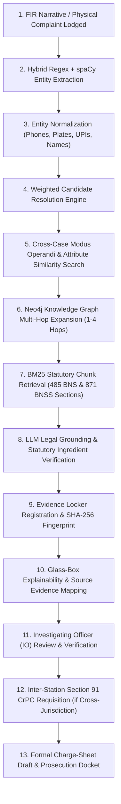

# S.I.R.I.S. — Smart Intelligence for Real-time Investigation Support

[](https://siris-backend-duzn.onrender.com/docs)
[](https://siris-odisha.vercel.app)
[](https://supabase.com)
[](https://neo4j.com)
[](https://github.com/kritisp/S.I.R.I.S)
[](https://github.com/kritisp/S.I.R.I.S)

> **S.I.R.I.S. helps investigators connect fragmented dots across criminal cases. It does not replace the investigator or autonomously determine criminal culpability.**

---

## 1. Project Overview & Core Philosophy

**S.I.R.I.S.** (*Smart Intelligence for Real-time Investigation Support*) is an AI-assisted criminal investigation and crime intelligence platform developed by **Team Tattvas**.

In modern law enforcement, critical investigative information is fragmented across disparate dockets, station registries, phone records, vehicle logs, and digital evidence lockers. S.I.R.I.S. operates as an **analytical intelligence layer alongside existing police infrastructure (such as CCTNS/ICJS)** to discover non-obvious multi-hop relationships, surface cross-case linkages, match Modus Operandi (MO), retrieve applicable Bharatiya Nyaya Sanhita (BNS 2023) provisions, and maintain tamper-evident evidence chains.

```
┌────────────────────────────────────────────────────────────────────────────────┐
│                          THE CORE INVESTIGATION PRINCIPLE                      │
│                                                                                │
│   Fragmented Data  ──►  Central Intelligence  ──►  Candidate Leads & Graphs    │
│   (FIRs, CDRs,           (Resolution, MO,          (Multi-hop Linkages,        │
│    Vehicles, Money)       BM25 Statutory RAG)       Cross-case Patterns)       │
│                                                             │                  │
│                                                             ▼                  │
│                                                   [ INVESTIGATOR VERIFICATION ]│
│                                                             │                  │
│                                                             ▼                  │
│                                                   [ LAWFUL POLICE ACTION ]     │
└────────────────────────────────────────────────────────────────────────────────┘
```

---

## 2. The Fundamental Problem

Criminal investigation records rarely exist in a single unified view:
* **The Vehicle Link**: A getaway motorcycle spotted in a new robbery FIR may have appeared in a chain-snatching docket 8 months ago at a different police station.
* **The Phone/Identity Link**: A suspect using an alias may share an alternate phone number or digital payment identifier with an associate in a narcotics syndicate.
* **The MO & Geographic Link**: The precise signature method (e.g. nocturnal latch-breaking with duplicate hydraulic cutters) may recur across police districts without cross-jurisdiction awareness.

**S.I.R.I.S. is not a simple database query tool.** It computes weighted multi-attribute similarity, traverses knowledge graphs up to 4 hops, identifies hidden syndicates, and presents empirical, explainable leads directly in the Investigating Officer's workspace.

---

## 3. Implementation Maturity & Feature Status

To ensure complete engineering transparency, system capabilities are classified based on their actual implementation status within this repository:

| Capability | Module / Subsystem | Maturity Level | Description |
| :--- | :--- | :--- | :--- |
| **Case Workspace & Docket Management** | `frontend/src/pages/CaseWorkspace.tsx` | **Implemented / Integrated** | Full interactive case dossiers, suspect tagging, evidence linking, and timeline tracking. |
| **Hybrid NLP Entity Extraction** | `ml/central-intelligence/.../hybrid_extractor.py` | **Implemented / Integrated** | Deterministic Regex + spaCy NER (`en_core_web_sm`) extracting phones, vehicle plates (`OD-02-...`), UPI IDs, and crypto wallets. |
| **Entity Resolution & Scoring** | `ml/central-intelligence/.../resolution/` | **Implemented / Integrated** | Weighted multi-attribute matcher combining phonetic (Double Metaphone), string similarity (Jaro-Winkler), DOB, phone, and vehicle overlap. |
| **Multi-Hop Knowledge Graph** | `ml/central-intelligence/.../services/graph/` | **Implemented / Integrated** | Remote Cloud Neo4j Aura integration with Cypher graph traversals, degree centrality, and community clustering. |
| **Statutory Legal RAG (BNS / BNSS)** | `ml/central-intelligence/.../bm25_rag_retriever.py` | **Implemented / Integrated** | In-memory BM25 chunk retriever over **485 BNS sections** & **871 BNSS rules** with Groq LLM statutory ingredient verification. |
| **Role-Based Command UI** | `frontend/src/components/dashboard/` | **Implemented / Integrated** | Distinct tailored dashboards for **Investigating Officer (IO)**, **Station In-Charge (IIC)**, and **State Command Superadmin**. |
| **Section 91 CrPC Inter-Station Flow** | `frontend/src/pages/AccessRequests.tsx` | **Implemented / Integrated** | Formal inter-station dossier requisition, supervisor approval routing, and audit logging. |
| **Evidence Custody & Hash Integrity** | `frontend/src/pages/EvidenceVault.tsx` | **Implemented / Integrated** | SHA-256 digital fingerprinting, custody transfer logs, and BNSS Sec 105 compliance checks. |
| **Communication / CDR Intelligence** | `frontend/src/pages/CdrIntelligencePage.tsx` | **Prototype / Demo** | Deterministic structured CDR metadata analysis, call frequency scoring, and cell-tower timeline mapping (*No live telecom tap*). |
| **Financial Flow & Mule Analysis** | `frontend/src/pages/IntelligenceFusionPage.tsx` | **Prototype / Demo** | Structured transaction graph traversal, pass-through mule account detection (*No live banking API*). |
| **CCTV / ANPR Geo-Trail Tracking** | `frontend/src/pages/CCTVModule.tsx` & `GeoTrailPage.tsx` | **Prototype / Demo** | Camera sighting reconstruction, transit route estimation using structured synthetic camera logs (*No live CCTV camera feed*). |
| **Graph Neural Networks (GNN)** | `ml/central-intelligence/app/services/graph/` | **Planned / Roadmap** | Future inductive link prediction and multi-relational GCN/GAT representations via PyTorch Geometric. |

---

## 4. End-to-End 13-Step Investigation Workflow



---

## 5. System Architecture & Component Interactions

```
┌────────────────────────────────────────────────────────────────────────────────────────┐
│                                 S.I.R.I.S. CLIENT TIER                                 │
│                   React 19 + TypeScript + Vite + Tailwind CSS + Lucide                 │
│         [ Case Workspace ]   [ Network Explorer ]   [ Evidence Vault ]   [ Command ]   │
└───────────────────────────────────────────┬────────────────────────────────────────────┘
                                            │ HTTPS / REST JSON
                                            ▼
┌────────────────────────────────────────────────────────────────────────────────────────┐
│                           CENTRAL INTELLIGENCE FASTAPI ENGINE                          │
│                                 (Python 3.11 on Render)                                │
│                                                                                        │
│  ┌──────────────────────┐  ┌──────────────────────┐  ┌──────────────────────────────┐  │
│  │   Hybrid NLP Engine  │  │  Resolution Engine   │  │   BM25 Statutory RAG Engine  │  │
│  │  • Deterministic Reg │  │  • Phonetic Matching │  │  • 485 BNS Section Chunks    │  │
│  │  • spaCy NER Extr.   │  │  • Attribute Weights │  │  • 871 BNSS Procedural Rules │  │
│  └──────────┬───────────┘  └──────────┬───────────┘  └──────────────┬───────────────┘  │
│             │                         │                             │                  │
│             └─────────────────────────┼─────────────────────────────┘                  │
│                                       ▼                                                │
│                        ┌──────────────────────────────┐                                │
│                        │  LLM Statutory & Reasoning   │                                │
│                        │ (Groq gpt-oss-120b / llama)  │                                │
│                        └──────────────┬───────────────┘                                │
└───────────────────────────────────────┼────────────────────────────────────────────────┘
                                        │
           ┌────────────────────────────┴────────────────────────────┐
           ▼                                                         ▼
┌──────────────────────────────────────┐  ┌──────────────────────────────────────────────┐
│        SUPABASE POSTGRESQL 15        │  │              CLOUD NEO4J AURA                │
│    (Dedicated IPv4 Pooler :6543)     │  │       (Remote Graph Database Bolt)           │
│  • Cases, Officers, Suspect Dockets  │  │  • (:PERSON)-[:INVOLVED_IN]->(:CASE)         │
│  • Evidence Records & Hash Chains    │  │  • (:PERSON)-[:ASSOCIATED_WITH]->(:PERSON)   │
│  • Section 91 Inter-Station Requests │  │  • (:CASE)-[:OCCURRED_AT]->(:LOCATION)       │
└──────────────────────────────────────┘  └──────────────────────────────────────────────┘
```

---

## 6. Subsystem Deep-Dive

### A. Central Intelligence & Entity Resolution (`ml/central-intelligence/`)
* **Deterministic Normalization**: Standardizes Indian phone numbers (`+91`, leading `0`), Odisha vehicle plates (`OD-02-AK-4455`), Aadhaar/PAN formats, and bank/UPI handles.
* **Multi-Attribute Resolution**: Computes confidence scores combining:
  $$\text{Score} = w_{\text{name}} \cdot S_{\text{JaroWinkler}} + w_{\text{phonetic}} \cdot S_{\text{DoubleMetaphone}} + w_{\text{phone}} \cdot \mathbb{I}_{\text{phone}} + w_{\text{vehicle}} \cdot \mathbb{I}_{\text{vehicle}}$$
* **Thresholds**: $\ge 0.80$ triggers high-confidence candidate match; $\ge 0.55$ flags possible connection for human review.

### B. BM25 Statutory Legal RAG Pipeline (`app/services/nlp/bm25_rag_retriever.py`)
* **Indexed Corpus**: Pre-parsed in-memory JSON corpus consisting of:
  * **485 sections** of Bharatiya Nyaya Sanhita (BNS 2023)
  * **871 procedural rules** of Bharatiya Nagarik Suraksha Sanhita (BNSS 2023)
* **Real-Time Execution**:
  1. Tokenizes incoming FIR narrative and extracts legal concepts.
  2. BM25 sparse ranker retrieves the top 8 candidate BNS sections and top 4 BNSS rules in **$< 3\text{ ms}$**.
  3. Physical statutory text chunks are injected directly into Groq LLM (`openai/gpt-oss-120b` / `qwen/qwen3.8-27b`) for strict statutory element verification.
  4. Requires only **$\sim 15\text{ MB}$ RAM**, eliminating cloud memory bottlenecks.

### C. Knowledge Graph & Criminal Network Topology (Cloud Neo4j Aura)
* **Node Labels**: `CASE`, `PERSON`, `PHONE`, `VEHICLE`, `LOCATION`, `EVIDENCE`, `LEGALSECTION`.
* **Graph Queries**:
  * Multi-hop link traversal ($1$ to $4$ hops) discovering shared phones, co-accused associates, and getaway vehicles.
  * Degree & Betweenness centrality highlighting network connectors and criminal syndicate coordinators.

### D. Evidence Integrity & Cryptographic Custody Chain
* **Digital Fingerprinting**: Generates SHA-256 cryptographic digests upon evidence intake.
* **Hash-Chained Custody Logs**: Every transfer of physical or electronic custody (seizure $\rightarrow$ station malkhana $\rightarrow$ State FSL $\rightarrow$ Court) appends to a tamper-evident audit ledger with BNSS Section 105 videography metadata.
* *Note on Blockchain*: The system emphasizes lightweight cryptographic hash chaining over heavy Hyperledger Fabric nodes to minimize latency and operational overhead for police stations.

### E. Controlled Inter-Station Boundaries (Lessons from Field Research)
* Observed during police station field visits that stations operate with strict jurisdictional boundaries.
* **Station Isolation**: Investigating Officers have direct access only to their station's dockets.
* **Section 91 CrPC Gateway**: When cross-case intelligence detects an entity match in another station, the IO must submit an electronic Section 91 Access Request, requiring supervisor (IIC) approval before viewing restricted dossiers.

---

## 7. Technology Stack

| Tier | Technologies |
| :--- | :--- |
| **Frontend UI** | React 19, TypeScript, Vite, Tailwind CSS, Lucide Icons, Vis-Network (Graph Rendering), Axios / Native Fetch. |
| **Backend API** | Python 3.11, FastAPI, Pydantic v2, SQLAlchemy ORM, Uvicorn ASGI. |
| **NLP & AI** | spaCy (`en_core_web_sm`), Pure-Python BM25 Index, Groq Cloud LLM API (`openai/gpt-oss-120b`, `qwen/qwen3.8-27b`). |
| **Databases** | Supabase PostgreSQL 15 (with Dedicated IPv4 Pooler), Cloud Neo4j Aura Enterprise (Cypher bolt protocol). |
| **DevOps & Hosting** | Render (FastAPI Web Service), Vercel (React Frontend), GitHub Actions (Keep-Alive Cron Workflow). |

---

## 8. Repository File Structure

```text
S.I.R.I.S/
├── .github/
│   └── workflows/
│       └── render_keep_alive.yml          # Automated 5-min health probe
├── frontend/                              # React 19 TypeScript application
│   ├── src/
│   │   ├── components/
│   │   │   ├── cases/                     # Case workspace & network explorer
│   │   │   ├── dashboard/                 # Role-tailored command strips & KPI ribbons
│   │   │   ├── evidence/                  # SHA-256 custody chain audit UI
│   │   │   └── layout/                    # SIH Header, Sidebar & Navigation
│   │   ├── pages/                         # 25+ Police operational views
│   │   ├── services/
│   │   │   ├── api/client.ts              # Authenticated API client
│   │   │   └── firAnalysisService.ts      # Live RAG pipeline connector
│   │   └── App.tsx                        # Application router
│   ├── package.json
│   └── vite.config.ts
├── ml/
│   ├── central-intelligence/              # Live FastAPI Central Intelligence Service
│   │   ├── app/
│   │   │   ├── api/v1/                    # REST route endpoints (cases, graph, evidence, auth)
│   │   │   ├── config/settings.py         # App configuration & credentials
│   │   │   ├── data/statutes/             # 485 BNS & 871 BNSS JSON statutory chunks
│   │   │   ├── database/postgres.py       # PostgreSQL & Supabase Pooler session
│   │   │   ├── models/                    # SQLAlchemy database schemas
│   │   │   └── services/
│   │   │       ├── graph/                 # Neo4j graph traversal & NetworkX analytics
│   │   │       ├── nlp/                   # Hybrid NLP & BM25 Statutory Chunk Retriever
│   │   │       ├── resolution/            # Multi-attribute entity resolution engine
│   │   │       └── llm_reasoning_engine.py# Groq LLM reasoning with PII scanner
│   │   ├── requirements.txt
│   │   └── sample_e2e_extraction.py       # E2E test verification script
│   └── fir-bns-rag/                       # Standalone BNS RAG reference & document cache
├── scripts/                               # Docker & verification helper scripts
├── .env.example                           # Master environment configuration template
└── README.md                              # Authoritative project documentation
```

---

## 9. Installation & Local Development Setup

### Prerequisites
* **Node.js** $\ge 18.0$ and **npm** $\ge 9.0$
* **Python** $\ge 3.11$
* **Git**

### 1. Clone Repository & Setup Environment
```bash
git clone https://github.com/kritisp/S.I.R.I.S.git
cd S.I.R.I.S

# Copy environment template
cp .env.example .env
```

### 2. Setup Central Intelligence Backend (FastAPI)
```bash
cd ml/central-intelligence

# Create and activate virtual environment
python -m venv .venv
# On Windows:
.venv\Scripts\activate
# On Linux/macOS:
source .venv/bin/activate

# Install dependencies
pip install -r requirements.txt
python -m spacy download en_core_web_sm

# Start FastAPI server on port 8000
uvicorn app.main:app --host 0.0.0.0 --port 8000 --reload
```

### 3. Setup Frontend Application (React Vite)
```bash
cd frontend

# Install dependencies
npm install

# Start Vite dev server on port 5173
npm run dev
```

Open `http://localhost:5173` in your browser.

---

## 10. Key API Endpoints Overview

| Method | Endpoint | Description |
| :--- | :--- | :--- |
| `POST` | `/api/v1/cases/fir/process-raw` | Submits raw FIR narrative; runs Hybrid Extraction, BM25 Statutory Retrieval, and LLM Element Verification. |
| `GET` | `/api/v1/cases/` | Returns list of registered cases filtered by police station and district. |
| `GET` | `/api/v1/graph/neighborhood/{node_id}` | Traverses Neo4j graph for $N$-hop connections around a person, vehicle, or case node. |
| `POST` | `/api/v1/graph/shortest-path` | Calculates shortest investigative relationship path between two arbitrary entities. |
| `POST` | `/api/v1/evidence/` | Registers physical or digital evidence with SHA-256 hash digest. |
| `GET` | `/api/v1/evidence/{evidence_id}/custody-chain` | Retrieves complete cryptographic chain-of-custody transfer history. |
| `POST` | `/api/v1/requests/` | Submits Section 91 CrPC inter-station dossier access requisition. |
| `GET` | `/api/v1/health` | Diagnostic probe testing PostgreSQL and remote Cloud Neo4j Aura connectivity. |

---

## 11. Important Disclaimers & Operational Boundaries

To maintain legal and technical integrity, the following boundaries are enforced:

1. **Not a Judicial Substitute**: S.I.R.I.S. does not determine criminal guilt or replace the Investigating Officer. All outputs are investigative leads requiring independent empirical corroboration.
2. **No Live Telecom Wiretap**: CDR analysis functions on structured, lawful historical call detail records provided pursuant to formal Section 91 CrPC notices.
3. **No Direct Banking Hack/Bypass**: Financial flow tracking is computed over structured bank statement exports and mule accounts provided by nodal authorities.
4. **No Live Police CCTV Interception**: ANPR and camera tracking operate over structured optical logs and timestamps provided by authorized traffic monitoring cells.
5. **No CCTNS Replacement**: S.I.R.I.S. is designed to integrate as an analytical layer alongside CCTNS and ICJS, not as a replacement for statutory government registries.

---

## 12. Team & Project Information

* **Project**: S.I.R.I.S. (*Smart Intelligence for Real-time Investigation Support*)
* **Team**: **Team Tattvas**
* **Target Jurisdiction**: Odisha Police & State Law Enforcement Agencies
* **Repository**: [https://github.com/kritisp/S.I.R.I.S](https://github.com/kritisp/S.I.R.I.S)
* **Live Deployment**:
  * Frontend: `https://siris-odisha.vercel.app`
  * Backend API: `https://siris-backend-duzn.onrender.com/api/v1`
  * API Documentation (Swagger): `https://siris-backend-duzn.onrender.com/docs`
